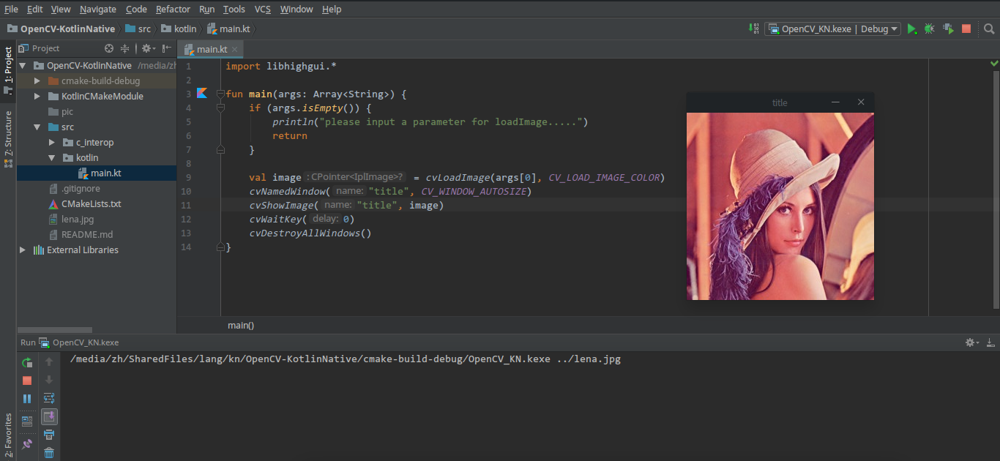
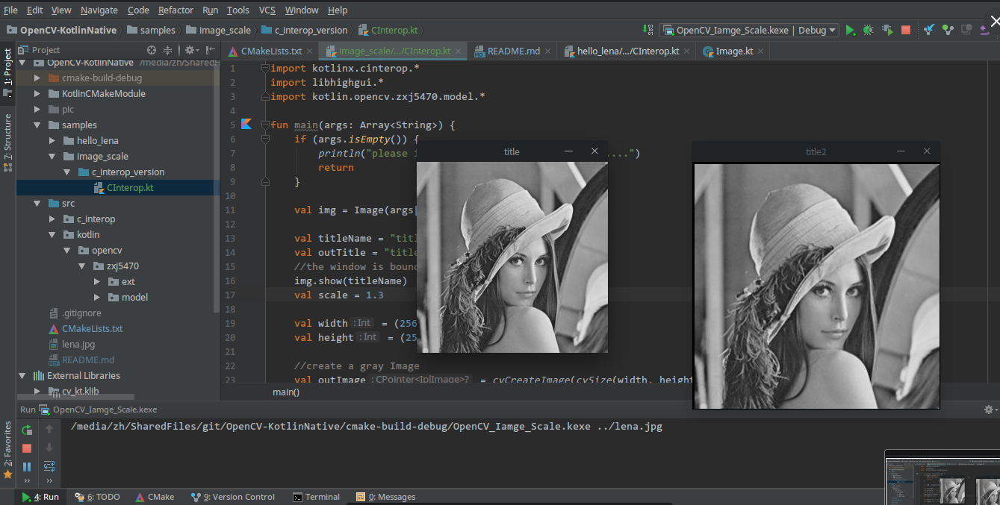

# OpenCV-KotlinNative

<!-- TOC -->

- [OpenCV-KotlinNative](#opencv-kotlinnative)
	- [Dependencies](#dependencies)
		- [Build Environment](#build-environment)
		- [Runtime dependencies](#runtime-dependencies)
	- [Environment](#environment)
	- [Run](#run)
		- [sample1: Hello Lena](#sample1-hello-lena)
		- [sample2: Scale a image](#sample2-scale-a-image)
	- [C_Interop](#c_interop)
	- [Misc (Linux Ubuntu/Debian/Deepin)](#misc-linux-ubuntudebiandeepin)

<!-- /TOC -->

## Dependencies

### Build Environment 
- OS: 
    - Linux (Ubuntu 18.04 + Deepin 15.5 Desktop)
        - sources build [Misc (Linux Ubuntu/Debian/Deepin)](#misc-linux-ubuntudebiandeepin)
    - macOS Sierra 10.12 
        - `brew install opencv@2`
        - Default Directory `/usr/local/opt/opencv@2`
- Kotlin Native version: 0.7
- OpenCV 2.4.13
- CLion 2018.1.2

### Runtime dependencies
- if Ubuntu or Debian
    - libgtk2.0-dev
    - pkg-config
- libopencv2_core
- libopencv2_highgui

## Environment
- macOS Sierra 10.12
- CLion (With Kotlin and Kotlin/Native Plugins)
- JDK 1.8

## Run
### sample1: Hello Lena
[hello_lena-c_interop_version](https://github.com/zxj5470/OpenCV-KotlinNative/blob/master/samples/hello_lena/c_interop_version/CInterop.kt)


### sample2: Scale a image
Scale 
- It needs about 30 seconds ... please wait a moment 
- (needs about 15 seconds in OS X with Intel i5 2.3 GHz and about 7 seconds in Linux/Ubuntu(Deepin Desktop Intel i5)
- so if you have a better algorithm to enhance the effect please tell me....)


## C_Interop
What you can interact-operator:
- libopencv2_core
- libopencv2_highgui (which include the former)

```kotlin
import libopencv2_highgui.*
```

## Misc (Linux Ubuntu/Debian/Deepin)

if your libs were installed in `/usr/local/lib` (Makefile settings with build OpenCV2)
like
```
cd opencv2.4.*
mkdir build
cd build
cmake .. -DCMAKE_INSTALL_PREFIX=/usr/local
```
then do these as follows:
```bash
$ vi /etc/ld.so.conf
```
append `/usr/local/lib` at the end:
```
include /etc/ld.so.conf.d/*.conf   # default
/usr/local/lib
```
then the command line to flush it.
```bash
sudo ldconfig
```
